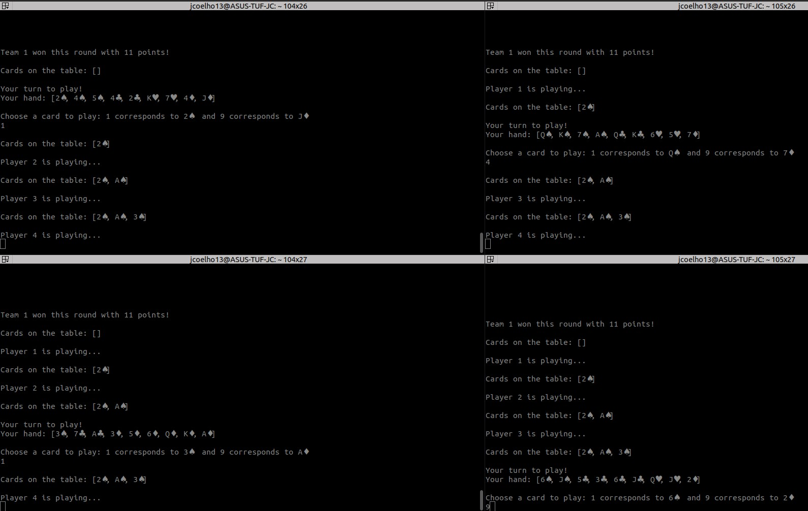
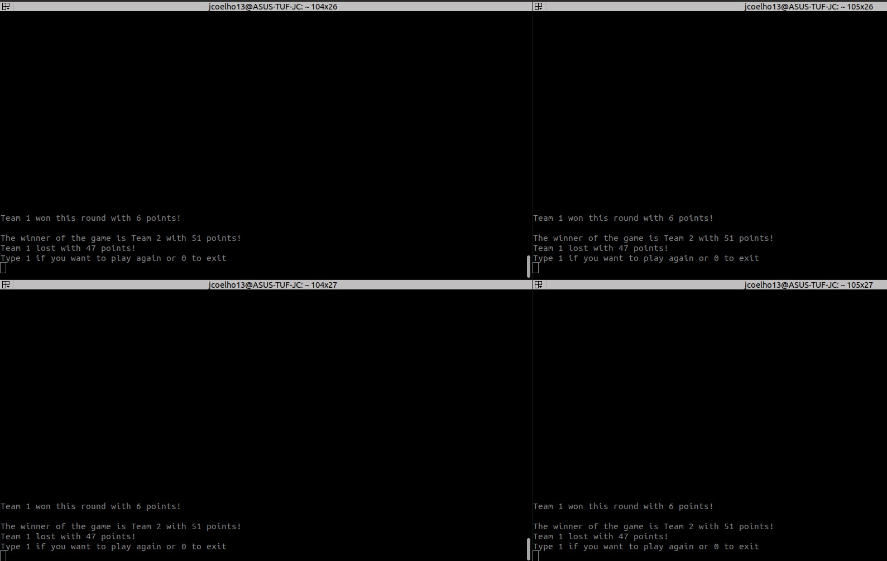

# Assignment 2 - Sueca

## G18:
- 202004846, João António Teixeira Coelho,
- 202108677, João Guimarães Mota,
- 202103337, Pedro Jorge Mendes Jesus Landolt

## Description
This project is an implementation of the card game Sueca. 
The game is played by four players, in two teams of two with a deck of 40 cards, with 4 suits (hearts, diamonds, clubs and spades) and 10 cards in each suit (2, 3, 4, 5, 6, Q, J, K, 7, A).
It has rounds, with each player playing a card in each round. The player who plays the highest card wins the round and starts the next round. 
The game ends when all cards are played.
The team with the most points at the end of the game wins, with each card being worth a different ammount of points.

## How to run
To run the game, open IntelliJ IDEA and run the main method in the Main class.
Then, open Terminator, open 4 different terminals and run the following commands in each terminal:
```
nc localhost 8000
```

You will then be ready to play the game.

## Features

### Account Creation
When entering the application, the user is greeted with a menu that allows them to login or register. 
For testing purposes, 4 accounts, with the usernames "1", "2", "3" and "4" and the passwords "1", "2", "3" and "4" respectively, have already been created.

However, if the user decides to create an account, they will be prompted to insert a username and a password.
The username must be unique.
The credentials are stored in a file called 'userinfo.csv', and the password is hashed using SHA-256.
A token is also generated for the user, which is used to authenticate the user in the game.

The logic for account creation can be found in the 'Authentication' class.

### Logging in
After creating an account, the user can login using the credentials they created.
We simply check if the username and password match the ones stored in the 'userinfo.csv' file.

The logic for logging in can be found in the 'Authentication' class.

### Ranked or Normal Game
After logging in, the user can choose to play a ranked or a normal game.

Ranked games affect the user's ranking, giving them 100 points if they win and -100 if they lose.
These points are then used to match the user with other users of similar skill level.

Normal games do not have this constraint.

Players wait in a queue. 4 are selected and a game is started.

Two types of queues are used: waitingQueueNormal and waitingQueueRanked. Both of these queues are implemented using ArrayList<Player>.
Both queues are protected by ReentrantLocks, to ensure that only one thread can access them at a time.

The players communicate through TCP sockets, with the server being the host.
Threads are used in the following manner:
- authThreads: These threads are responsible for authenticating incoming connections. Each thread runs the connectionAuthenticator method in a loop, which accepts new connections and starts a new thread to handle the initial menu for each player.  
- normalGameThreads and rankedGameThreads: Responsible for managing the game queues for normal and ranked games respectively. They continuously check if there are enough players in the queue to start a new game. If there are, they remove the players from the queue, create a new Game instance, and start a new thread to run the game.  
- connectionAuthenticatorThread: Responsible for authenticating incoming connections. It runs the connectionAuthenticator method in a loop, similar to the authThreads.  
- newPlayerRunnable: Started for each player that connects to the server. It runs the initialMenu method for the player, which handles the initial interaction with the player after they connect.  
- Game threads: Started for each game that begins. They run the Game instance created when enough players are in the queue.

The players then play the game. Below, are a few screenshots displaying the game in action.


